<div align=center></div>

# Tide

目前实现了网络空间资产探测、指纹检索、漏洞检测、漏洞全生命周期管理、poc定向检测、暗链检测、挂马监测、敏感字检测、DNS监测、网站可用性监测、漏洞库管理、安全预警等~

```
tips1:两三个人利用两周时间完成了大体的框架，但后续各种优化完善断断续续搞了小半年时间，目前来说还是和zoomeye差距灰常大。

tips2:团队没有专门做前端的，借鉴了fofa和zoomeye的部分前端，惭愧~

tips3:功能再完善一些，拟准备开源。

```
# Change Log

- [2018-07-11] 优化了资产发现的效率，使用了solr进行查询，查询速度有了一定提升
- [2018-05-02] 爬虫功能、安全监测、poc检测基本实现，测试了很多的工具和脚本
- [2018-03-18] 基本实现了网络资产的自动化探测、端口开放检测、指纹识别等
- [2018-02-13] 初步订好了几个大的功能框架，包括资产探测、poc检测、安全监测等
  

# Function

开始只是想防个zoomeye，能探测一定范围内的空间资产，后来断断续续加入了很多功能模块，就有了现在的Tide。

## 前台展示

- 前台主界面

查询主界面，各种协议、端口总量的展示，平台的简介等。

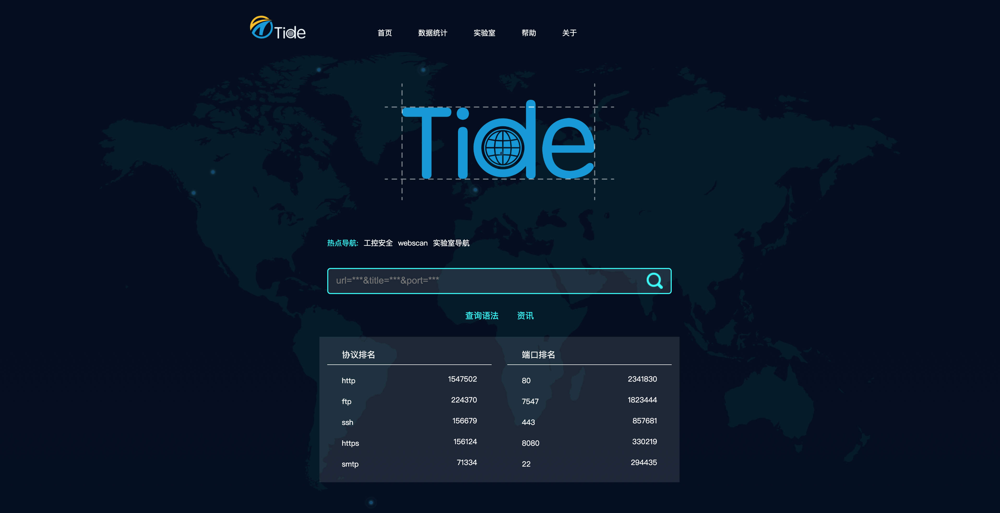

- 数据统计

对全国范围或某地区数据进行汇总展示，对各端口、协议进行图表展示。

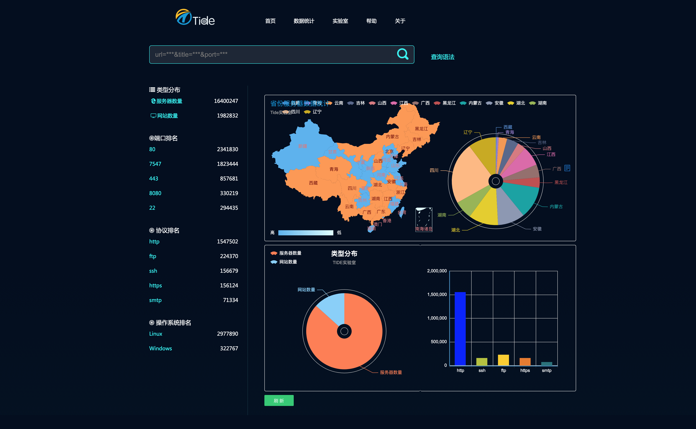

- 查询语法

提供查询语法、查询接口等。

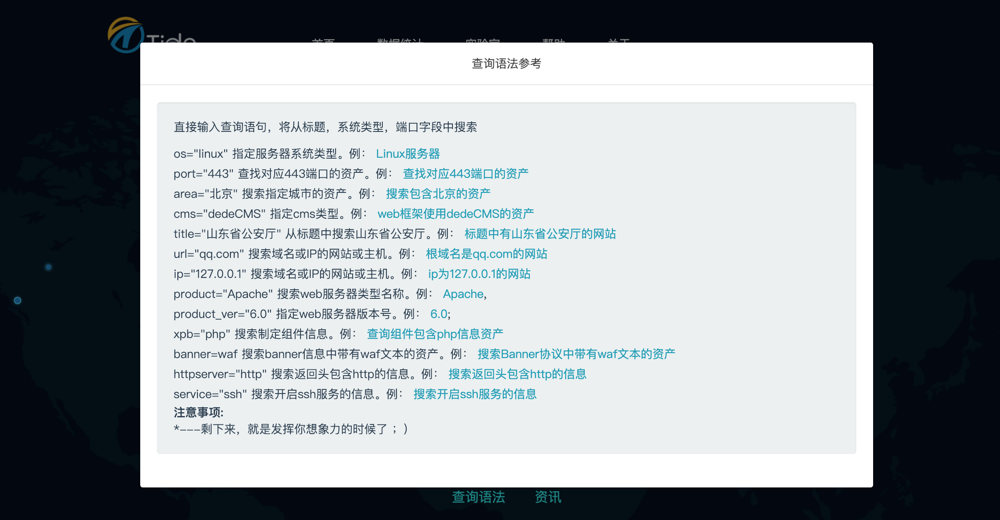

- 资产展示

借鉴了zoomeye和shodan的展示格式。

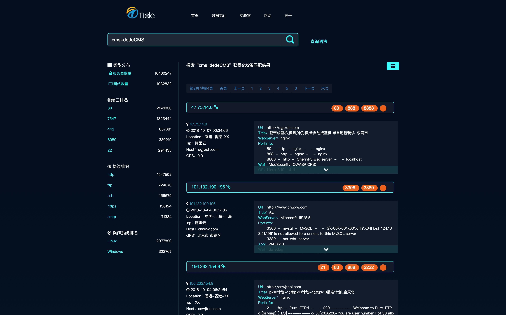

- 详细数据

资产的详细信息：url、ip、标题、端口、端口服务、服务版本号、cms信息、操作系统信息、web中间件信息、waf信息、xpb信息、ip地址信息等等

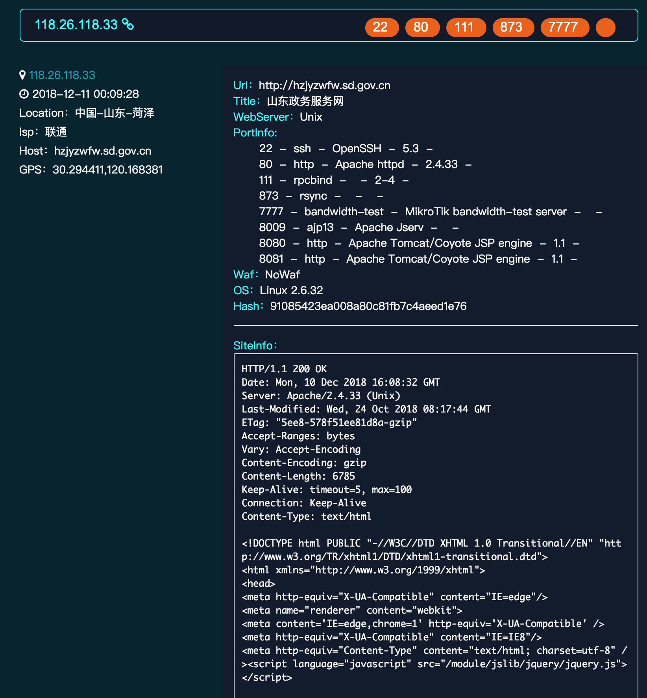

## 后台管理

- 管理控制台

还在完善，增加更多图表数据，争取高大上一些。

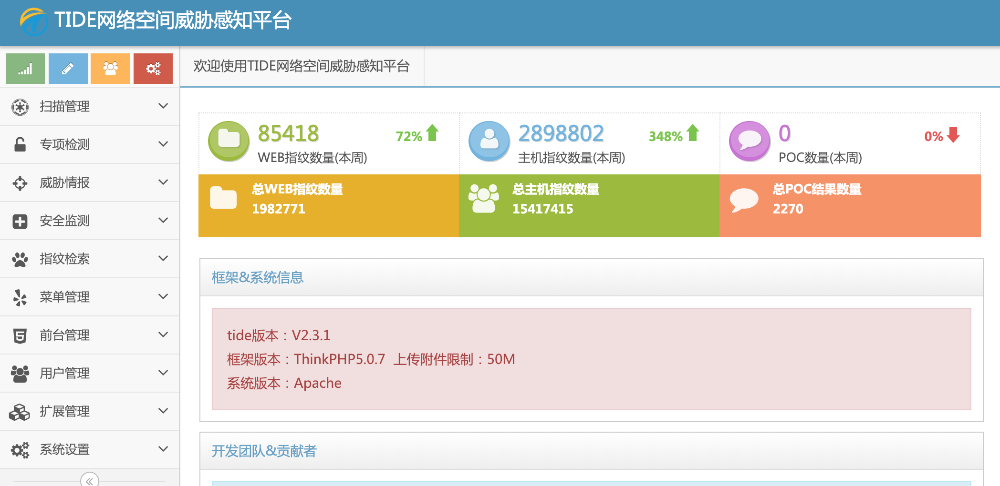

### 扫描管理

主要功能：

1、漏洞扫描主要整合了wvs、w3af和自研的一些小平台，把漏洞进行汇总整理，并导出详细报告。

2、可根据配置地址对应用系统进行自动扫描，还可设置定时扫描、扫描周期、扫描范围等相关功能，以满足用户多元化需求。

3、可记录漏洞的概念以及漏洞的整个生命周期，包括漏洞的产生、发现、公开、管理和消亡，并详细介绍漏洞在生命周期中每个阶段的成因、形式、发现方法和具体的应对措施。

- 扫描任务

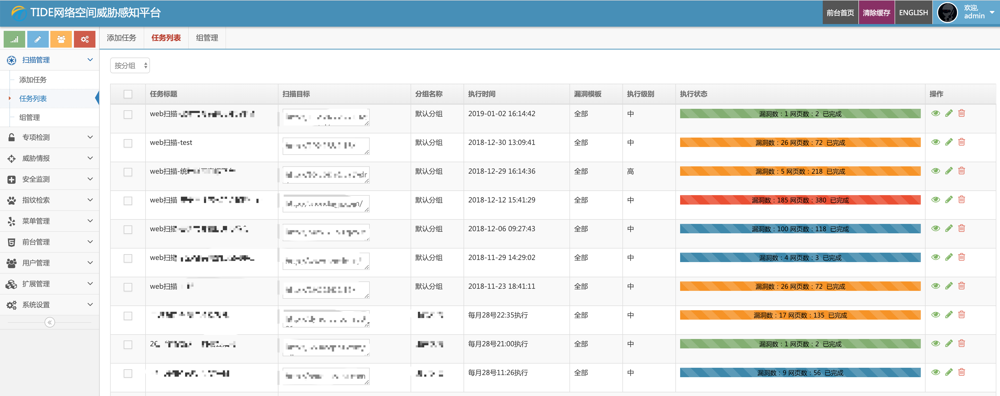

- 扫描详情

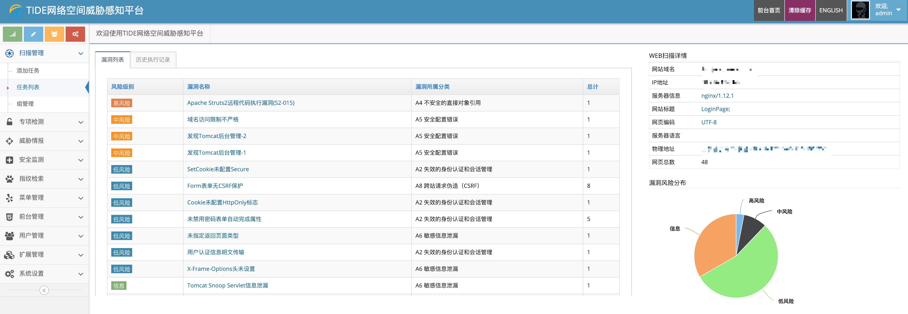

### POC检测
主要功能：

1、POC检测使用了成熟的POC框架POCSUITE，修改了一些借口，和Tide能完美对接，改写了很多插件，让检测更自动化。

2、对常见插件漏洞、中间件漏洞等通用漏洞进行检测，如weblogic反序列化、Struts2等漏洞进行验证。在新漏洞爆发时，用户可利用该功能进行针对性检测。

- POC管理

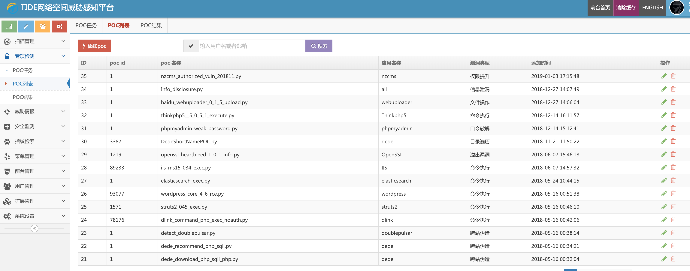


- POC检测结果

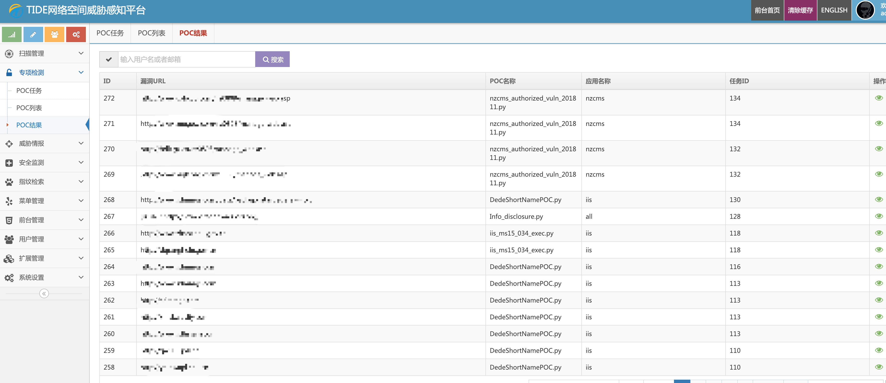

### 威胁情报

主要功能：

说是威胁情报，其实就是一堆漏洞库和安全监测的数据，主要搜集爬取各公开漏洞库并进行整理，对重点客户常态监测暗链、敏感字等情况，另外添加了fangong黑客的监测，很鸡肋的一个功能。

- 漏洞库

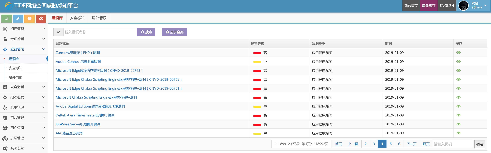

- 安全感知

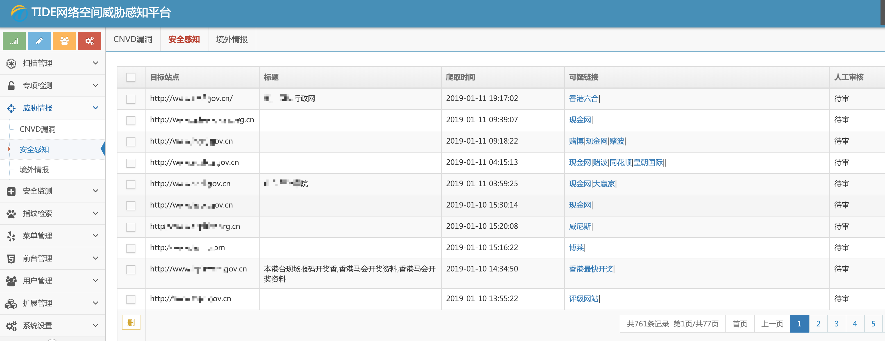

- 境外情报

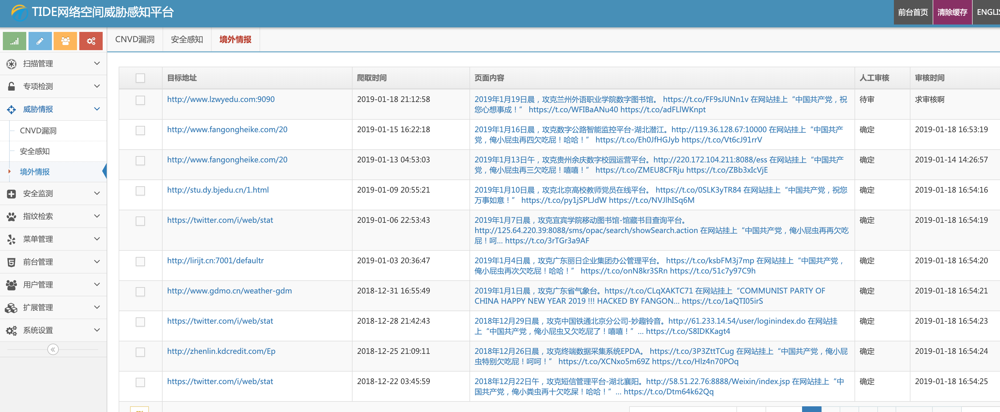

### 安全监测

主要功能：

1、在敏感信息对重点客户进行持续性的监测，采用全文检索、应用目录枚举、图片文件检查等手段对网站进行敏感信息检测，并对发现的敏感信息进行导出，从而协助用户对网站进行有效监管。

2、可7*24小时对网站进行监控，模拟访客请求访问，实时获取响应状态、响应时间、响应结果，及时发现网站异常情况。

3、针对网站出现增加、删除、修改、挂马等安全事件时进行实时快照并留存，用户可快速找到安全事件记录，以便进行溯源追查。

- 网站可用性监测

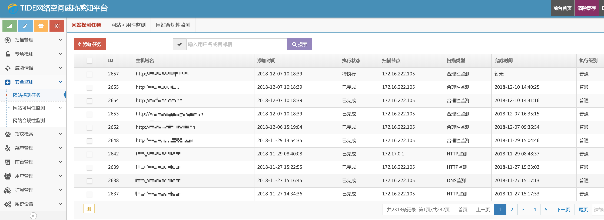

- 网站合规性监测

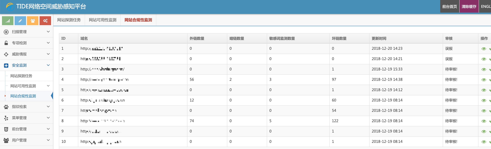

### 指纹检索

主要功能：

1、对操作系统版本、开放端口、提供的服务、服务版本进行识别进行识别。

2、对服务端语言、Web开发框架、Web应用CMS、前端库、第三方组件等进行识别。

3、通过接口查询、字典枚举等方式获取该域名下的所有子域名，根据需要映射出目标网络的整体结构。

4、综合检索能对系统内指纹进行更详细的合种模式的检索查询，比前台检索功能更加强大，并可批量导出检索结果。

- 主机指纹管理

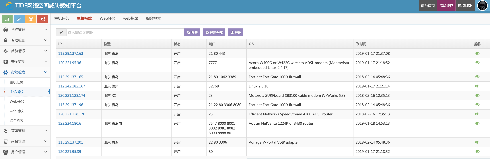

- 主机指纹详情

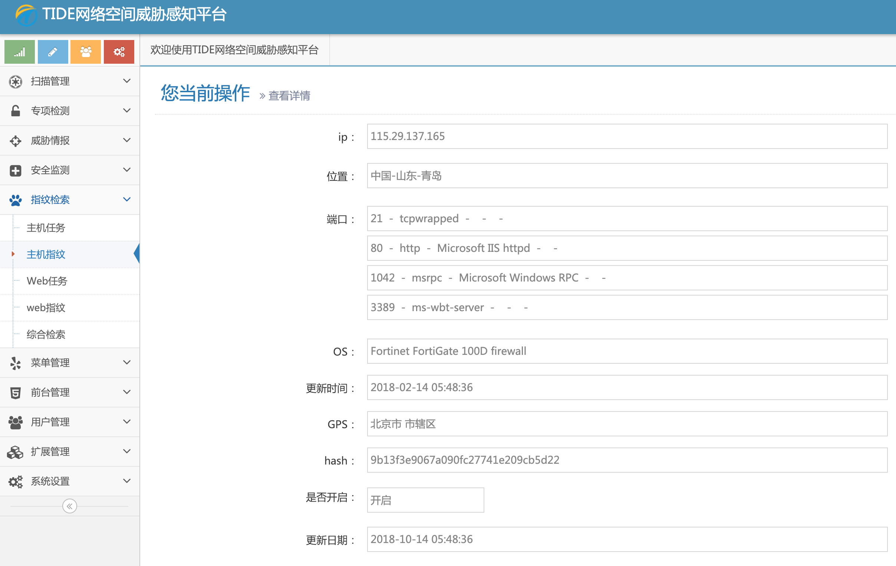

- Web指纹管理

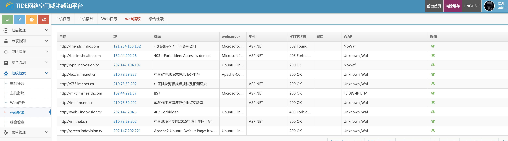

- Web指纹详情

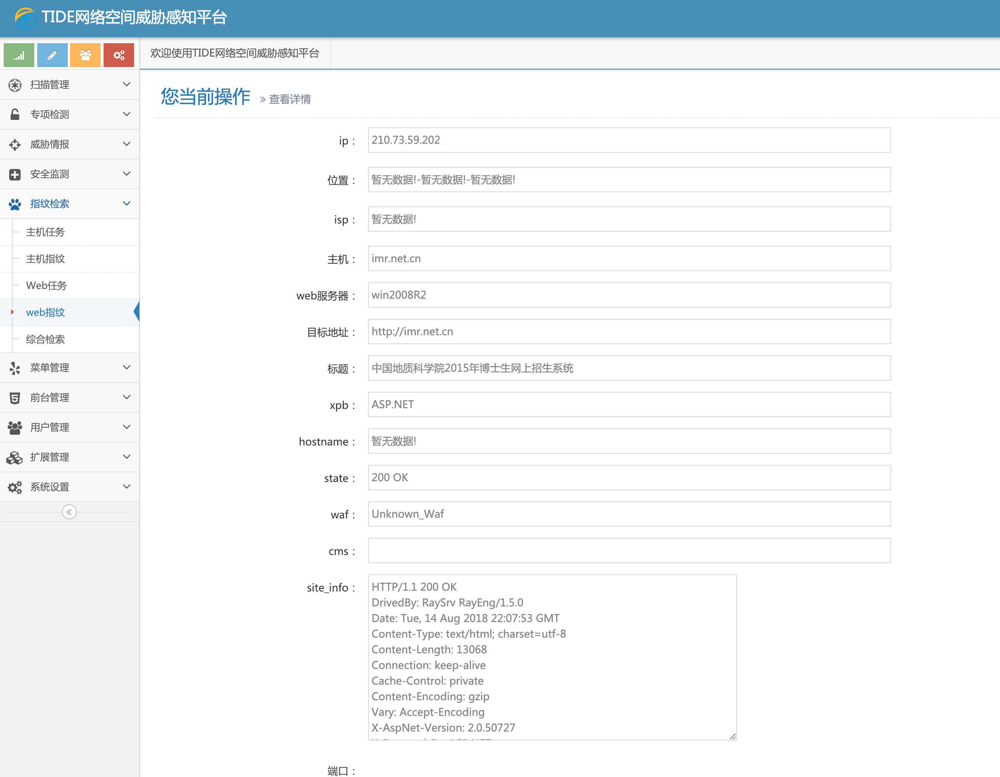

- 综合检索

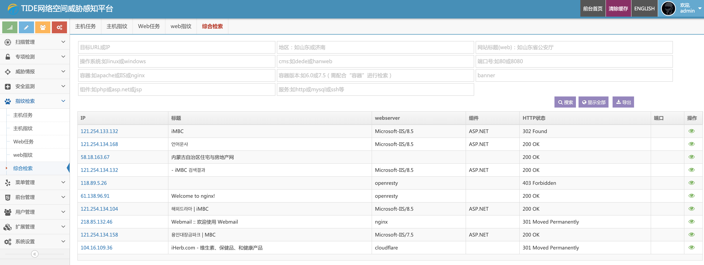


# ToDo

- 做个自己的前端！
- 完善策略，对空间探测效率和精准度进行提升
- 添加更多指纹库，识别更多资产
- 对漏洞全生命周期的管理进行完善
- 降低敏感字、暗链、webshell的检测误报率


