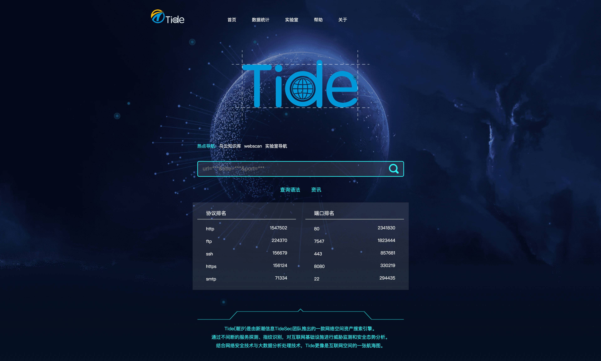

<div align=center></div>

# Tide

Tide(潮汐)是由新潮信息TideSec团队推出的一款网络空间资产搜索引擎。通过不间断的服务探测、指纹识别，对互联网基础设施进行威胁监测和安全态势分析。结合网络安全技术与大数据分析处理技术，Tide更像是互联网空间的一张航海图。

Tide(潮汐)目前实现了网络空间资产探测、指纹检索、漏洞检测、漏洞全生命周期管理、poc定向检测、暗链检测、挂马监测、敏感字检测、DNS监测、网站可用性监测、漏洞库管理、安全预警等~

在这里和大家分享一下Tide在空间测绘方面实现的一些方法和技巧，虽然和zoomeye、fofa没什么可比性，但平台整体成本比较低，比较适用于小团队开发运作

```
tips1:两三个人利用两周时间完成了大体的框架，但后续各种优化完善断断续续搞了小半年时间，目前来说还是和zoomeye差距灰常大。

tips2:团队没有专门做前端的，借鉴了fofa和zoomeye的部分前端，流下了没有技术的泪水~

tips3:功能再完善一些，拟准备开源。

tips4:感谢Xxlm、Yune、紫瀚等团队成员的长期付出（www.tidesec.net）

```

**Demo地址：`http://demo.tidesec.net`**

(经同行提示，该平台可能涉及互联网基础信息搜集可能不合规，所以暂时下线，见谅。)

****

# 目录
* [Change_Log](#Change_Log)
* [建设背景](#建设背景)
* [主要功能及实现方法](#主要功能及实现方法)
    * [资产发现](#资产发现)
    * [指纹识别](#指纹识别)
    * [扫描管理](#扫描管理)
    * [POC检测](#POC检测)
    * [安全监测](#安全监测)
* [Function](#Function)
    * [前台展示](#前台展示)
        * 前台主界面
        * 数据统计
        * 查询语法
        * 资产展示
        * 详细数据
    * [后台管理](#后台管理)
        * [扫描管理](#扫描管理)
            * 扫描任务
            * 扫描详情
        * [POC检测](#POC检测)
            * POC管理
            * POC检测结
        * [威胁情报](#威胁情报)
            * 漏洞库
            * 安全感知
            * 境外情报
        * [安全监测](#安全监测)
            * 网站可用性监测
            * 网站合规性监测
        * [指纹检索](#指纹检索)
            * 主机指纹管理
            * 主机指纹详情
            * Web指纹管理
            * Web指纹详情
            * 综合检索
* [ToDo](#ToDo)
    
    
# Change_Log

- [2018-07-11] 优化了资产发现的效率，使用了solr进行查询，查询速度有了一定提升
- [2018-05-02] 爬虫功能、安全监测、poc检测基本实现，测试了很多的工具和脚本
- [2018-03-18] 基本实现了网络资产的自动化探测、端口开放检测、指纹识别等
- [2018-02-13] 初步定好了几个大的功能框架，包括资产探测、poc检测、安全监测等
 
# 建设背景
随着配合网安的一些工作越来越多，有时候经常需要对一定范围内的主机或应用系统进行摸排。

比如我们坐标山东，而山东省持有的IP地址大约为1800万（数据来自IANA、纯真IP和差错网），如果每次都需要扫一些端口和服务那需要耗费比较多的时间和精力。如果想快速获取指定地区的资产信息就只能从zoomeye、shodan、fofa等类似的平台获取，但这些平台一般查询都有一定限制，比如限制条数，比如工控端口没法查看ip等等，而且在某一特定地区的精准度可能稍微差一些，所以萌生了自己仿钟馗之眼做个资产探测平台的想法。

开始只是想仿个zoomeye，能探测一定范围内的空间资产，但后来断断续续加入了很多功能模块，就有了现在的Tide。目前已经基本能满足某一地区的资产的搜集探测，在一些网安的配合工作中也能快速出一些数据，其他一些功能模块也在逐渐完善，待大体完善后考虑开源。

由于平台是两三个人在项目之余慢慢堆积出来的，没有懂前端的，所以前台展示借鉴了zoomeye和fofa的页面，不知道有没有侵权，大佬不要打我们。。

# 主要功能及实现方法

之前画的一个框架图，大部分实现了，有些还在努力。 


## 资产发现

目前主要是对山东省内资产进行发现探测，也包含了部分其他省份和云上资产，内网生产数据库中数据量为3000W，web类资产大约160W。

1、由于人力、物力、财力都比较有限，所以只部署了十来台探测节点（还是512M内存）进行持续性探测，探测可分为模糊探测和精准探测两种模式，模糊探测时每天大约探测主机500W，精准探测时大约为20W主机、3万web应用。

模糊探测主要是使用masscan和zmap结合去发现开放的主机和端口，精确探测使用了自己写的一些脚本去发现逐个测试端口可用性，再用nmap获取指纹信息，我们也在对一些工控协议、物联协议写一些探测脚本并加入到指纹识别中。后续会慢慢写一些关于端口探测和指纹识别的一点心得。

在平台前期只是使用了nmap进行扫描并获取指纹，后来发现效率太低太低，让人无法忍受，而且nmap在获取指纹时经常出现内存错误导致无法扫描的情况，所以后来使用了masscan和zmap等结合的方式，目前也在尝试使用zgrab等一些新的方式来提高效率和准确度。


2、十来台探测节点中一半是用来探测新的任务，新的任务可以由前台提交，在前台没有任务时会对随机ip进行探测；另外一半节点是对旧的资产进行回归探测，这样基本能保证系统中的数据都能比较新。比较遗憾的是目前还只是保存最新的数据，对历史数据没有进行保存。

扫描节点的任务调度费了一些劲，目前是根据各扫描节点领取的任务和花费的时间进行评分，这样一些优先级比较高的任务就可以调度评分高的扫描节点来执行任务。不过目前还都是在同一个局域网环境中，所以评分差别不是很大。经过测试，512内存和1G内存的评分的确有些差距。

3、对大范围的ip地址的探测精准度和速度还有待提升，根据目前的探测效率大体算了下，全球互联网精准探测估计得两年大规模探测方面和zoomeye或fofa还差的太远。。。留下了没有技术的泪水。。。

## 指纹识别

1、对操作系统版本、开放端口、提供的服务、服务版本进行识别进行识别。

这部分主要是靠nmap来实现，目前也在研究指纹识别的一些原理性东西，打算以后能自己实现个探测引擎。nmap的最大问题是效率比较低，有时候配置一些参数(如--min-hostgroup和--min-parallelism)可以提高速度，但误报率又会升高。所以在扫描时，节点会根据网络情况自动选择一些参数。

比较常用的参数：

```
nmap  -sS  -sV  -T4 -O --script=banner --open --min-hostgroup 1024 --min-parallelism 1024 --host-timeout 30m  -p 80

```
对扫描的结果进行提取分析，并导入数据库。

没有用pynmap库，之前用了段时间发现经常报错，好像和nmap的内存优化有一定关系。所以后来直接调用nmap，生成.xml再解析。

2、对服务端语言、Web开发框架、Web应用CMS、前端库、第三方组件等进行识别。

web应用的指纹稍微复杂，自己实现了几个小的工具来探测http头、waf、cms等，借鉴了whatweb、wafw00f的一些思路。

3、通过接口查询、字典枚举等方式获取该域名下的所有子域名，根据需要映射出目标网络的整体结构。

对每个web目前都会进行子域名枚举，这样能进可能多的发现一些web应用，子域名枚举借鉴了lijiejie和猪猪侠的子域名枚举思路，还搭配使用了谷歌、百度子域名检索等方式，并对泛解析也进行了预判。


## 扫描管理

1、漏洞扫描主要整合了wvs、w3af和自研的一些小平台，把漏洞进行汇总整理，并导出详细报告。

因为wvs的结果是英文的，如果需要提供报告给客户的话友好度不高，所以对wvs的扫描结果、加固建议、漏洞描述等进行了汉化。

对wvs的汉化主要是爬取了wvs官方的漏洞库，对较为常见的漏洞进行了人工翻译，然后使用谷歌翻译对其他漏洞进行了翻译，人工进行了核对，最终大约包含670个漏洞。

汉化后的数据库可从这个项目中获取，`https://github.com/TideSec/WDScanner`，在数据库文件的vul_cn表中。


2、可根据配置地址对应用系统进行自动扫描，还可设置定时扫描、扫描周期、扫描范围等相关功能，以满足用户多元化需求。

3、可记录漏洞的概念以及漏洞的整个生命周期，包括漏洞的产生、发现、公开、管理和消亡，并详细介绍漏洞在生命周期中每个阶段的成因、形式、发现方法和具体的应对措施。

## POC检测

1、POC检测使用了成熟的POC框架POCSUITE，修改了一些借口，和Tide能完美对接，改写了很多插件，让检测更自动化。

POC检测应该是最有用的功能了，可以对某一地区某端口进行检索，然后将结果导入到poc检测任务中，进行快速、批量的检测。

2、对常见插件漏洞、中间件漏洞等通用漏洞进行检测，如weblogic反序列化、Struts2等漏洞进行验证。在新漏洞爆发时，用户可利用该功能进行针对性检测。

## 安全监测

1、在敏感信息对重点客户进行持续性的监测，采用全文检索、应用目录枚举、图片文件检查等手段对网站进行敏感信息检测，并对发现的敏感信息进行导出，从而协助用户对网站进行有效监管。

2、可7*24小时对网站进行监控，模拟访客请求访问，实时获取响应状态、响应时间、响应结果，及时发现网站异常情况。

3、针对网站出现增加、删除、修改、挂马等安全事件时进行实时快照并留存，用户可快速找到安全事件记录，以便进行溯源追查。


# Function

开始只是想防个zoomeye，能探测一定范围内的空间资产，后来断断续续加入了很多功能模块，就有了现在的Tide。

## 前台展示

- 前台主界面

查询主界面，各种协议、端口总量的展示，平台的简介等。



- 数据统计

对全国范围或某地区数据进行汇总展示，对各端口、协议进行图表展示。


- 查询语法

提供查询语法、查询接口等。


- 资产展示

借鉴了zoomeye和shodan的展示格式。


- 详细数据

资产的详细信息：url、ip、标题、端口、端口服务、服务版本号、cms信息、操作系统信息、web中间件信息、waf信息、xpb信息、ip地址信息等等


## 后台管理

- 管理控制台

还在完善，增加更多图表数据，争取高大上一些。


### 扫描管理

主要功能：

1、漏洞扫描主要整合了wvs、w3af和自研的一些小平台，把漏洞进行汇总整理，并导出详细报告。

2、可根据配置地址对应用系统进行自动扫描，还可设置定时扫描、扫描周期、扫描范围等相关功能，以满足用户多元化需求。

3、可记录漏洞的概念以及漏洞的整个生命周期，包括漏洞的产生、发现、公开、管理和消亡，并详细介绍漏洞在生命周期中每个阶段的成因、形式、发现方法和具体的应对措施。

- 扫描任务


- 扫描详情


### POC检测
主要功能：

1、POC检测使用了成熟的POC框架POCSUITE，修改了一些借口，和Tide能完美对接，改写了很多插件，让检测更自动化。

2、对常见插件漏洞、中间件漏洞等通用漏洞进行检测，如weblogic反序列化、Struts2等漏洞进行验证。在新漏洞爆发时，用户可利用该功能进行针对性检测。

- POC管理


- POC检测结果


### 威胁情报

主要功能：

说是威胁情报，其实就是一堆漏洞库和安全监测的数据，主要搜集爬取各公开漏洞库并进行整理，对重点客户常态监测暗链、敏感字等情况，另外添加了fangong黑客的监测，很鸡肋的一个功能。

- 漏洞库


- 安全感知


- 境外情报


### 安全监测

主要功能：

1、在敏感信息对重点客户进行持续性的监测，采用全文检索、应用目录枚举、图片文件检查等手段对网站进行敏感信息检测，并对发现的敏感信息进行导出，从而协助用户对网站进行有效监管。

2、可7*24小时对网站进行监控，模拟访客请求访问，实时获取响应状态、响应时间、响应结果，及时发现网站异常情况。

3、针对网站出现增加、删除、修改、挂马等安全事件时进行实时快照并留存，用户可快速找到安全事件记录，以便进行溯源追查。

- 网站可用性监测


- 网站合规性监测


### 指纹检索

主要功能：

1、对操作系统版本、开放端口、提供的服务、服务版本进行识别进行识别。

2、对服务端语言、Web开发框架、Web应用CMS、前端库、第三方组件等进行识别。

3、通过接口查询、字典枚举等方式获取该域名下的所有子域名，根据需要映射出目标网络的整体结构。

4、综合检索能对系统内指纹进行更详细的合种模式的检索查询，比前台检索功能更加强大，并可批量导出检索结果。

- 主机指纹管理


- 主机指纹详情


- Web指纹管理


- Web指纹详情


- 综合检索


# ToDo

- 做个自己的前端！
- 完善策略，对空间探测效率和精准度进行提升
- 添加更多指纹库，识别更多资产
- 对漏洞全生命周期的管理进行完善
- 降低敏感字、暗链、webshell的检测误报率


# 关注我们

**TideSec安全团队：**

Tide安全团队正式成立于2019年1月，是以互联网攻防技术研究为目标的安全团队，目前聚集了十多位专业的安全攻防技术研究人员，专注于网络攻防、Web安全、移动终端、安全开发、IoT/物联网/工控安全等方向。

想了解更多Tide安全团队，请关注团队官网: http://www.TideSec.net 或关注公众号：

<div align=center></div>

**和我联系：**

<div align=center></div>
